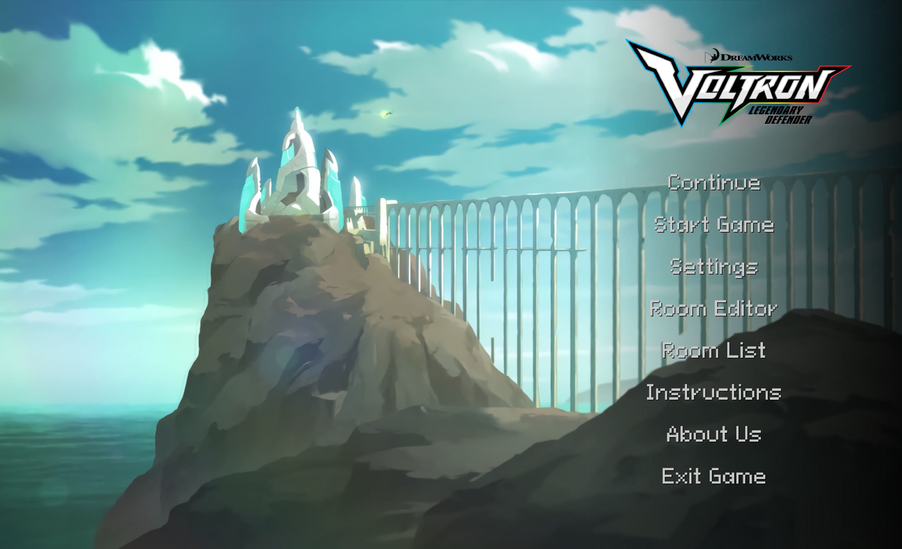
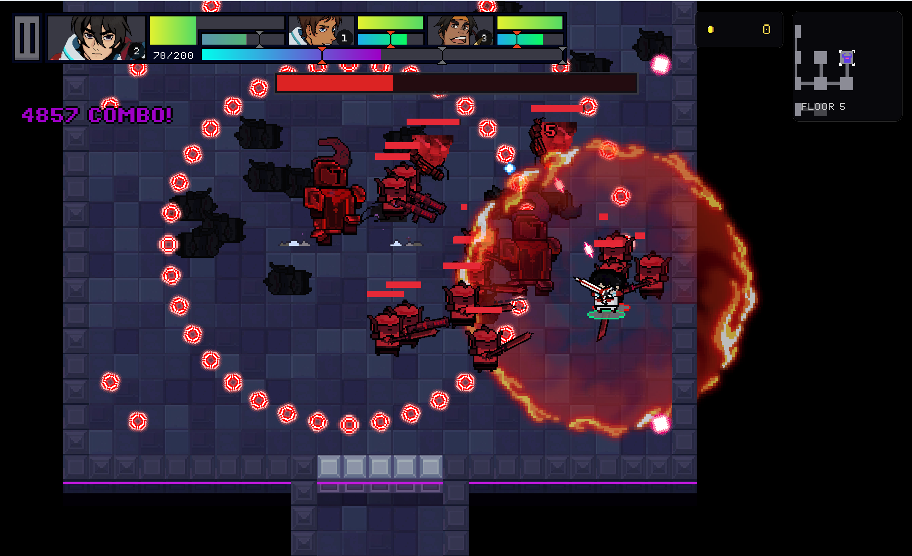

# Voltron Mission: Galra Cypher

**Voltron Mission: Galra Cypher** is a C++17 game developed as a semester project for **CS202** in the **Advanced Program in Computer Science (APCS)** at the **University of Science, VNU-HCM (HCMUS)** during the **2025-2026 academic year**.

The project demonstrates object-oriented game architecture, real-time combat systems, procedural content generation, artificial intelligence, responsive user interfaces, and lightweight persistence using raylib and CMake.

## Meet the Developer

| Developer | Student ID |
| --- | --- |
| `Trần Phúc Khánh` | `25125020` |
| `Hoàng Nguyên Anh`| `25125002` |

## Enter the Galra Cypher

> **Five floors. Three Paladins. One mission.**

The Galra are waiting. Assemble your strike team, enter a hostile stronghold, and fight through a campaign where every new floor raises the stakes.



### Assemble Your Paladin Team

Choose a three-character squad from **Keith, Lance, Hunk, and Pidge**. Each Paladin brings a different weapon, combat role, skill, and ultimate ability. Switch characters in real time, manage shared resources, build massive combos, and call on the right hero when the battle turns against you.

- Select three Paladins and freely organize the active team.
- Swap characters during battle without interrupting the action.
- Combine unique attacks, skills, ultimates, defensive tools, and team resources.
- Improve the squad through rewards, supplies, and enhancement rooms.

### Conquer Five Escalating Floors

No two missions follow exactly the same route. Procedural generation connects combat rooms with chest, enhancement, portal, and utility encounters, while Room Editor creations can join the same generation pool as the built-in battlefields.

- Clear room-based waves to unlock the path forward.
- Discover increasingly dangerous enemies as the campaign progresses.
- Navigate with a responsive minimap and scalable gameplay HUD.
- Continue a mission from lightweight checkpoints that preserve meaningful progression without recording every frame of an active battle.

### Fight at Full Power

Combat is fast, crowded, and built around constant decisions. Enemy archetypes use distinct behaviors, line-of-sight attacks, A*/flow-field navigation, and local avoidance to hunt the active Paladin through destructible, room-scale battlefields.



Survive melee charges, ranged fire, diving attacks, drones, summoned reinforcements, and screen-filling projectile patterns. Responsive menus, dialogue, settings, combat feedback, and developer diagnostics support the action without taking control away from the player.

### Face the Final Threat

Reach Floor 5 and the final chamber opens. A cinematic, multi-phase boss encounter stands between the Paladins and victory, escalating through summons, projectile storms, fire punches, and devastating stomps.

**Choose your team. Adapt your strategy. Break through the Galra Cypher.**

## Technology Behind the Mission

- **Language:** C++17
- **Graphics and input:** raylib 5.5
- **Build system:** CMake 3.15+
- **Development platforms:** Windows, Linux, and macOS with a compatible C++17 toolchain
- **Core systems:** State-driven gameplay, manager-based architecture, procedural rooms, enemy AI, collision handling, audio, UI, and checkpoint persistence

## Build and Launch the Game

### Prepare the Toolchain

- CMake 3.15 or newer
- A C++17 compiler
- Git and an internet connection during the first configuration so CMake can fetch raylib

### Compile the Mission

```sh
cmake -S . -B build
cmake --build build --config Release
```

### Start the Game

Run the executable from the repository root:

```sh
# Windows
build/VoltronMissionGalraCypher.exe

# Linux or macOS
./build/VoltronMissionGalraCypher
```

Depending on the selected CMake generator, the executable may be placed inside a configuration folder such as `build/Release/`.

## Explore the Codebase

```text
assets/   Runtime images, sprites, audio, fonts, maps, and UI resources
include/  Public C++ headers and system interfaces
src/      Game implementation organized by AI, combat, core, entities, and UI
tmp/      Temporary project documentation and development notes
```

## Educational Project Credits

This repository was created as an educational course project. Voltron and related names or visual material belong to their respective rights holders; this project is not affiliated with or endorsed by them.
